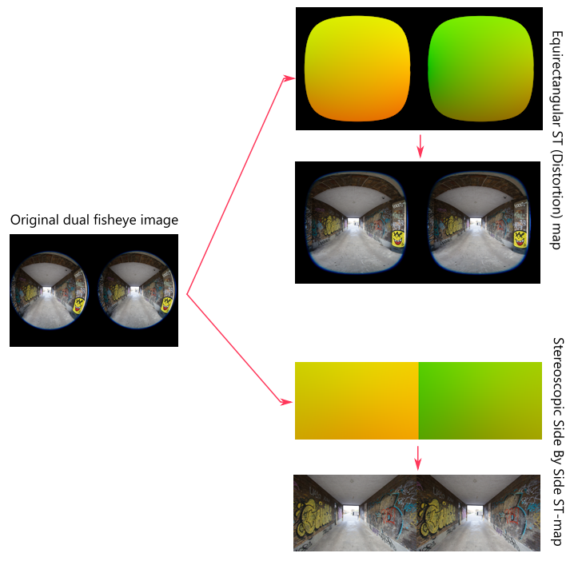

# VR180 Image Converter 

[](https://www.python.org/)  
[](LICENSE)

## 🚀 Overview

The **VR180 Image Converter** is a small tool I made for the purpose of getting the most out of my Canon R7 with the Dual Fisheye 3.9mm lens. The "Canon EOS VR Utility" works fine, but it has some conservative choices and I felt more could be squeezed from this setup.

```bash
$ python convert_VR180_images.py -h
usage: convert_VR180_images.py [-h] --st ST --input_folder INPUT_FOLDER --output_folder OUTPUT_FOLDER

Process images with an ST map.

options:
  -h, --help            show this help message and exit
  --st ST               Path to the ST map in EXR format
  --input_folder INPUT_FOLDER
                        Path to the folder containing input images
  --output_folder OUTPUT_FOLDER
                        Path to the folder for saving output images

```

---

## 🛠 Features

- 🎥 **Batch Processing**: Converts all images in a folder, runs in parallel and very fast.
- 📜 **Customizable Distortion Maps**: Use included ST maps or create your own for specific requirements.
- 🖼 **Output Control**: Generates high-quality JPEG images with only a single resampling conversion, for least amount of loss.
- 🌍 **Utilizes all of captured image**: The 3.9mm lens is sold as 144° FOV. In reality it is more like 154°, but the outermost part has more chromatic distortions and is removed by the "Canon EOS VR" Utility. I include it as it makes the images more immersive.

---

### What are ST-Maps ?

ST-Maps are like special images, where each pixel acts as a set of instructions for "where to grab a pixel from another image." Each pixel in the ST-Map has three color channels: Red, Green, and Blue. However, we only use two of them to store two numbers: the X and Y coordinates of the pixel we want to copy from the original image.

This approach allows us to create a map that can morph the shape of one image into another. It’s a powerful tool because it can handle all kinds of transformations, such as cropping, lens distortion, or converting to an equirectangular format. The best part is that it performs all these adjustments in a single step, avoiding multiple rounds of resampling or resizing, which helps preserve the quality of the final image.



Included in this project are pre-made maps. But be aware these have baked in alignment and might not be perfect for your camera. I am working on a better tool which will make these maps. Contact me if you want help on making a map for your own setup.

[Canon R7 dual fisheye 3.9mm photo (6960x4640) - equirectangular](maps/R7_still_conversion_ST.exr)

[Canon R7 dual fisheye 3.9mm photo (6960x4640) - flat stereoscopic](https://drive.google.com/file/d/1ZwtnKOCAC2uYfpMcTV79F0SKxqinNdKL/view?usp=sharing)

[Canon R7 7.8mm stereographic lens photo (6960x4640) - (4 maps - equirectangular, flat 1:1, flat wide and portrait](https://drive.google.com/file/d/1MgYUbzWOudgdL6AC8DClig4J51oBwPNF/view?usp=sharing)

[Canon R5 dual fisheye 5.2mm photo (8192x5454) - equirectangular](https://drive.google.com/file/d/1mpHEOztuarhH6w7TtuqTCWAf2TxxqlJK/view?usp=sharing)

---

## 📂 Getting Started

### 1. Prerequisites

Ensure you have [Python 3.x](https://www.python.org/downloads/) installed.

### 2. Download repository

Download zipfile or clone this repository.

### 3. Install requirements

If you are familiar with python, you might want to use a virtual environment, otherwise just run :

```bash
pip install -r requirements.txt
```

To install requirements needed for the script.

### 4. Run

Run the tool on command line:

```bash
python convert_VR180_images.py  --st maps/R7_still_conversion_ST.exr --input_folder "C:\input_files\" --output_folder "C:\input_files\SBS\"
```

